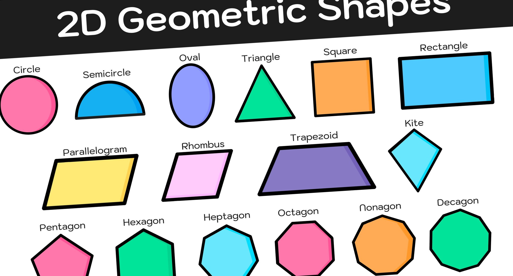

# 2D Geometric Shapes Dataset



## Description

This repository contains a Python script used to generate a dataset of 2D geometric shapes, along with the dataset itself. The dataset includes 16 different geometric shapes, each randomly oriented and positioned within a 224x224 pixel image.

## Shapes Included

- Circle
- Semicircle
- Oval
- Triangle
- Square
- Rectangle
- Parallelogram
- Rhombus
- Trapezoid
- Kite
- Pentagon
- Hexagon
- Heptagon
- Octagon
- Nonagon
- Decagon

## Dataset Structure

- **`shapes_dataset/`**: Contains subdirectories for each shape, with 100 PNG images per shape.
  - `circle/`
    - `circle_1.png`
    - `circle_2.png`
    - ...
  - `semicircle/`
  - ...
- **Total Images**: 1,600 (100 images \* 16 shapes)

## Installation

To generate the dataset on your own, clone this repository and run the script:

```bash
git clone https://github.com/Khalid1G/shapes-dataset.git
cd shapes-dataset
pip install pillow
python generate_shapes_dataset.py
```

## License

This dataset is released under the [MIT License](LICENSE).

## Usage

The dataset can be used for various purposes, such as training machine learning models for shape classification or object detection tasks. The images are saved in PNG format with transparent backgrounds, making them easy to overlay on other images.

## Contributing

Contributions to this repository are welcome. Some ideas for contributions include:

- Adding new shapes to the dataset
- Improving the script to generate more diverse shapes
- Creating additional scripts to preprocess or augment the dataset
- Using the dataset for a machine learning project and sharing the results

If you would like to contribute, please open an issue or a pull request.

## Acknowledgements

This dataset was created by [Khalid1G](https://github.com/khalid1G) as part of a personal project. The shapes were generated using the Python Imaging Library (PIL) and saved as PNG images.

## Contact

If you have any questions about this dataset, feel free to contact me at [khalid.boussaroual@gmail.com](mailto:khalid.boussaroual@gmail.com), [kboussaroual@insea.ac.ma](mailto:kboussaroua@insea.ac.ma), [LinkedIn](https://www.linkedin.com/in/khalid-boussaroual/), or open an issue in this repository.
